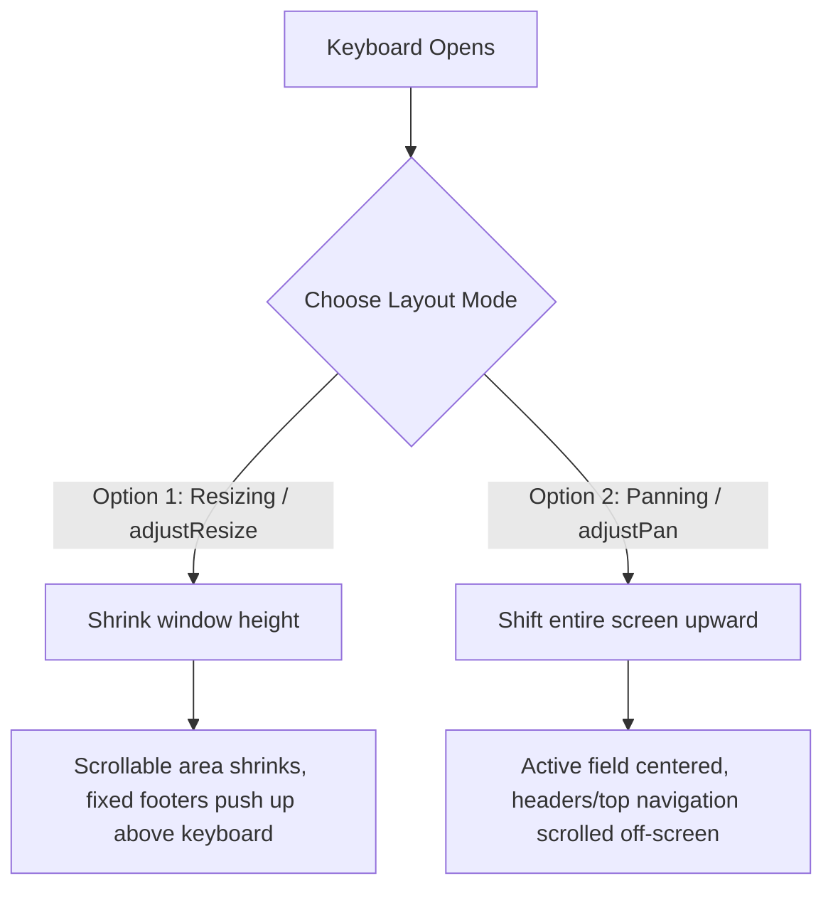

# Mobile Keyboard UX: Industry Best Practices & Architecture

In mobile application development, the software keyboard is one of the most critical interaction points. An poorly integrated keyboard leads to visual clipping, hidden buttons, confusing focus shifts, and user frustration. On the other hand, a premium keyboard experience feels invisible: the screen moves fluidly, the input fields are positioned optimally, and inputs are configured contextually to minimize keystrokes.

This guide outlines the industry-standard design patterns, platform differences, and technical implementation blueprints for achieving premium keyboard UX on mobile devices.

---

## 1. Core Dimensions of Keyboard UX

### A. View Adjustments (Resizing vs. Panning)
When the software keyboard appears, it occupies between **30% and 50%** of the screen's vertical real estate. The host application must adapt its layout immediately.



*   **Window Resizing (`adjustResize` / Default):** The active application window height is reduced by the height of the keyboard. This is the **preferred standard for 90% of screens** (especially chat feeds and complex forms) because it preserves the visibility of top navigation headers and keeps fixed elements (like action bars) resting cleanly on top of the keyboard.
*   **Window Panning (`adjustPan`):** The window size remains unchanged, and the OS simply shifts the viewport upward so that the focused input is visible. This is acceptable for simple screens (like login cards) but is avoided for screens with fixed elements, as it pushes headers and action bars off the screen.

---

### B. Smart Input Configurations
Configuring the keyboard type and behavior programmatically is the easiest way to reduce friction and typos.

| Input Type | Keyboard Type | Auto-Capitalize | Auto-Correct | Text Content Type (Autofill) |
| :--- | :--- | :--- | :--- | :--- |
| **User Name** | `default` | `none` | `false` | `username` |
| **Email Address** | `email-address` | `none` | `false` | `emailAddress` |
| **Password** | `default` | `none` | `false` | `password` |
| **Phone Number** | `phone-pad` | `none` | `false` | `telephoneNumber` |
| **Numerical Code (OTP)**| `number-pad` / `numeric` | `none` | `false` | `oneTimeCode` |
| **Search Query** | `default` | `sentences` | `true` | `none` (Return Key = `search`) |
| **Paragraph / Notes** | `default` | `sentences` | `true` | `none` |

---

### C. Keyboard Dismissal Triggers
Forcing users to find a specific button to close the keyboard is a major UX flaw. Premium apps support multiple intuitive dismiss gestures:

1.  **Tap-to-Dismiss (Background Taps):** Tapping on any non-interactive part of the screen (empty canvas, background card) should automatically blur the active input and hide the keyboard.
2.  **Scroll-to-Dismiss (Drag-to-Dismiss):** In message feeds (e.g., Slack, iMessage) or long scrollable forms, dragging or scrolling down the list should dismiss the keyboard in lockstep with the drag velocity.
3.  **Return Key Dismissal:** Pressing the virtual "Done" or "Search" key on the keyboard should blur focus and dismiss the UI.

---

### D. Input Accessory Views
An **Input Accessory View** is a toolbar attached directly to the top of the software keyboard. It moves in exact sync with the keyboard's opening and closing animations.

```
+-----------------------------------+
| Send Photo | Attach EMR | Clear   | <-- Input Accessory Bar
+-----------------------------------+
| Q | W | E | R | T | Y | U | I | O |
|  A | S | D | F | G | H | J | K |  |
|    | Z | X | C | V | B | N | M |   |
+-----------------------------------+
```

*   **Form Navigation:** Displays "Previous" and "Next" arrows alongside a "Done" button to help users traverse inputs sequentially without tapping each field.
*   **Rich Media / Context Actions:** Provides immediate actions like inserting image attachments, text-formatting controls (bold, italic), or contextual templates (e.g. quick phrases for clinical messaging).

---

## 2. Platform Comparison: iOS vs. Android

iOS and Android handle keyboard resizing, inset calculations, and safe areas differently.

| Feature | iOS | Android |
| :--- | :--- | :--- |
| **Window Adjustments** | Handled completely inside the application container. The system does not automatically resize the window unless directed via APIs. | Handled natively by the OS window manager (typically `adjustResize`). The screen boundaries shrink automatically. |
| **Animation Matching** | iOS provides frame-by-frame keyboard height animation coordinates via `keyboardWillShow` / `keyboardWillHide`. | Android's keyboard animation is historically disjointed. Frame-accurate syncing requires modern WindowInsets APIs (`WindowInsetsAnimationCompat`). |
| **Edge-to-Edge Drawing** | Natural system behavior; safe area insets are preserved at the screen edges. | Configured via `edgeToEdgeEnabled`. Safe-area providers can sometimes get stuck or report stale insets during transitions. |
| **Physical Return Key** | Configured via the text input component (`returnKeyType="done"`). | Supports standard return actions but can also be customized natively. |

---

## 3. Best Practices Checklist

| Rule | UX Rationale | Implementation Detail |
| :--- | :--- | :--- |
| **1. Never Clip Focused Fields** | Users must see what they are typing in real time. | Scroll the ScrollView dynamically to position the focused input at least `24px` above the top of the keyboard. |
| **2. Keep Primary CTA Sticky** | Users shouldn't need to close the keyboard to submit a single-input page. | Place the submit button inside the resized container or attachment bar so it sits directly above the keyboard. |
| **3. Auto-Focus Contextually** | Do not trigger keyboard on page load unless the input is the primary intent. | Set `autoFocus={true}` on search pages or PIN validation screens; keep it `false` on profile edit forms. |
| **4. Dismiss on Scroll** | Scrolling is an explicit signal that the user is shifting from "writing" to "reading". | Configure scroll components with `keyboardDismissMode="on-drag"` or `keyboardDismissMode="interactive"`. |
| **5. Contextual Action Keys** | The bottom-right key should match the action intent (Go, Send, Search, Next). | Avoid defaulting to a generic newline return key on search boxes or single-line fields. |

---

## 5. Implementation Blueprint (React Native / Expo)

Here is a bulletproof implementation of a scrollable form that handles platform differences, auto-focus scrolling, backdrop dismissals, and dynamic bottom safe area preservation.

```javascript
import React, { useState, useRef, useEffect } from 'react';
import {
  View,
  ScrollView,
  TextInput,
  Text,
  StyleSheet,
  Platform,
  KeyboardAvoidingView,
  TouchableWithoutFeedback,
  Keyboard
} from 'react-native';
import { useSafeAreaInsets } from 'react-native-safe-area-context';

export default function SmartForm() {
  const insets = useSafeAreaInsets();
  
  // 1. Capture initial bottom inset to prevent keyboard transition layout shifts
  const [initialBottomInset] = useState(insets.bottom);
  const [keyboardVisible, setKeyboardVisible] = useState(false);
  const scrollViewRef = useRef(null);

  useEffect(() => {
    // Sync keyboard visibility status for conditional layout changes
    const showEvent = Platform.OS === 'ios' ? 'keyboardWillShow' : 'keyboardDidShow';
    const hideEvent = Platform.OS === 'ios' ? 'keyboardWillHide' : 'keyboardDidHide';

    const showSub = Keyboard.addListener(showEvent, () => setKeyboardVisible(true));
    const subHide = Keyboard.addListener(hideEvent, () => setKeyboardVisible(false));

    return () => {
      showSub.remove();
      subHide.remove();
    };
  }, []);

  // 2. Wrap screen in TouchableWithoutFeedback to allow tap-to-dismiss background gestures
  return (
    <TouchableWithoutFeedback onPress={Keyboard.dismiss}>
      <View style={styles.outerContainer}>
        
        {/* 
          3. Platform-Specific Keyboard Avoidance:
             - iOS requires 'padding' to offset content.
             - Android resizes natively, so we pass 'undefined' to prevent double-resizing.
        */}
        <KeyboardAvoidingView
          style={styles.keyboardView}
          behavior={Platform.OS === 'ios' ? 'padding' : undefined}
          keyboardVerticalOffset={Platform.OS === 'ios' ? 64 : 0}
        >
          <ScrollView
            ref={scrollViewRef}
            contentContainerStyle={styles.scrollContent}
            keyboardShouldPersistTaps="handled"
            keyboardDismissMode="on-drag" // 4. Drag-to-dismiss support
          >
            <Text style={styles.title}>Clinical Log</Text>
            
            <TextInput
              style={styles.input}
              placeholder="Username"
              autoCapitalize="none"
              autoCorrect={false}
              textContentType="username"
            />

            <TextInput
              style={styles.input}
              placeholder="Full Name"
              autoCapitalize="words"
              textContentType="name"
            />

            <TextInput
              style={[styles.input, styles.textArea]}
              placeholder="Enter patient diagnosis summary..."
              multiline={true}
              autoCapitalize="sentences"
              autoCorrect={true}
            />
          </ScrollView>

          {/* 
            5. Sticky Footer Action Bar:
               - Uses the static initialBottomInset when keyboard is closed to clear gesture pills.
               - Squeezes down to standard padding (12px) when keyboard is open.
          */}
          <View style={[
            styles.footer,
            {
              paddingBottom: keyboardVisible ? 12 : Math.max(initialBottomInset, 12)
            }
          ]}>
            <View style={styles.button}>
              <Text style={styles.buttonText}>Submit Record</Text>
            </View>
          </View>
        </KeyboardAvoidingView>
      </View>
    </TouchableWithoutFeedback>
  );
}

const styles = StyleSheet.create({
  outerContainer: {
    flex: 1,
    backgroundColor: '#F8FAFC',
  },
  keyboardView: {
    flex: 1,
  },
  scrollContent: {
    padding: 24,
  },
  title: {
    fontSize: 24,
    fontWeight: '800',
    color: '#0F172A',
    marginBottom: 24,
  },
  input: {
    backgroundColor: '#FFFFFF',
    borderWidth: 1,
    borderColor: '#E2E8F0',
    borderRadius: 8,
    padding: 12,
    fontSize: 16,
    marginBottom: 16,
    height: 48,
  },
  textArea: {
    height: 120,
    textAlignVertical: 'top',
  },
  footer: {
    backgroundColor: '#FFFFFF',
    borderTopWidth: 1,
    borderTopColor: '#E2E8F0',
    paddingHorizontal: 24,
    paddingTop: 12,
  },
  button: {
    backgroundColor: '#0284C7',
    borderRadius: 8,
    paddingVertical: 14,
    alignItems: 'center',
  },
  buttonText: {
    color: '#FFFFFF',
    fontWeight: '700',
    fontSize: 16,
  },
});
```

---

## 6. Conclusion
Great mobile keyboard UX is the sum of subtle, deliberate configurations:
1.  **Configure inputs accurately** so users never see an alphabetic keyboard for a numerical PIN.
2.  **Keep the layout stable** by leveraging platform-native resizing (Android) and frame-accurate padding offsets (iOS).
3.  **Acknowledge safe-area dimensions statically** to prevent layout jumps during transitions.
4.  **Embrace natural gestures** like tapping out or dragging down to close the keyboard.
