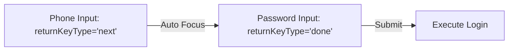

# Keyboard UX Implementation Plan for DoctorSaap

This document outlines the feasible keyboard layout modes and detailed UX enhancements (such as context-aware keyboard types, autocapitalization settings, dismissal gestures, and focus progression) specifically mapped to the screens and elements in the DoctorSaap project.

---

## 1. Summary of Feasible Keyboard Layout Modes

The keyboard layout adjustment strategy must be tailored to the layout structure of each screen:

| Screen Type | Feasible Layout Mode | Tech Rationale | Target Files |
| :--- | :--- | :--- | :--- |
| **Chat / Messaging** | **Resizing (`adjustResize`)** | Keeps bottom-anchored input bar resting exactly above the keyboard; doesn't scroll history off-screen. | [ChatScreen.js](file:///c:/Users/ASUS/DoctorSaap/mobile-app/src/screens/ChatScreen.js) |
| **Long Scrollable Forms** | **ScrollView + Resizing** | Shrinks screen height and programmatically scrolls focused fields into viewport; allows scrolling through other fields while typing. | [AddPatientScreen.js](file:///c:/Users/ASUS/DoctorSaap/mobile-app/src/screens/AddPatientScreen.js) |
| **Centered Cards (Auth)** | **ScrollView + Centered Container** | Avoids squeezing form fields while keeping card centered; allows scrolling if the keyboard height is tall. | [LoginScreen.js](file:///c:/Users/ASUS/DoctorSaap/mobile-app/src/screens/LoginScreen.js) |
| **Bottom Sheet / Modals** | **Modal Resizing Overlay** | Shrinks modal viewport and lifts inputs upwards above the keyboard overlay. | [PatientDetail.js](file:///c:/Users/ASUS/DoctorSaap/mobile-app/src/screens/PatientDetail.js) [VitalsScreen.js](file:///c:/Users/ASUS/DoctorSaap/mobile-app/src/screens/VitalsScreen.js) |

---

## 2. Screen-by-Screen Keyboard UX Improvements

### A. Login & Server Settings Screen
**Target File**: [LoginScreen.js](file:///c:/Users/ASUS/DoctorSaap/mobile-app/src/screens/LoginScreen.js)

1.  **Auto-Dismiss on Background Tap**:
    *   **UX Pattern**: Tapping the brand area or grey space outside the inputs should blur the keyboard.
    *   **Pointer**: Wrap the `ScrollView` content (around line 123) in a `<TouchableWithoutFeedback onPress={Keyboard.dismiss}>`.
2.  **Input Behavior & Autocompletion Configuration**:
    *   **Phone Number Input** (line 230): Set `keyboardType="phone-pad"`, `textContentType="telephoneNumber"`, `autoComplete="tel"`, and `returnKeyType="next"`.
    *   **Password Input** (line 246): Set `secureTextEntry={!showPassword}`, `textContentType="password"`, and `returnKeyType="done"`.
    *   **Server Settings URL Input** (line 307): Set `keyboardType="url"`, `autoCapitalize="none"`, `autoCorrect={false}`, and `returnKeyType="done"`.
3.  **Focus Flow (Next Key)**:
    *   Add a `useRef` for the password field and trigger `.current.focus()` inside the Phone input's `onSubmitEditing` handler.

---

### B. EMR Add/Edit Patient Screen (Long Form)
**Target File**: [AddPatientScreen.js](file:///c:/Users/ASUS/DoctorSaap/mobile-app/src/screens/AddPatientScreen.js)

1.  **Context-Aware Keyboard Types**:
    *   **Age Input** (line 230): Set `keyboardType="number-pad"` (already set to `"numeric"` which is good, but `number-pad` on iOS is cleaner as it doesn't display symbols).
    *   **Numeric Fields**: Set `keyboardType="number-pad"` for:
        *   **Patient ID** (line 224)
        *   **IPD ID** (line 258)
        *   **Bed No** (line 263 - currently has no `keyboardType` set)
        *   **Lab Parameters (Hb, TC, Neu, Lym, etc.)** (lines 27-30): Set to `keyboardType="decimal-pad"` to allow decimal entries like `14.2`.
2.  **Auto-Capitalization & Auto-Correction**:
    *   **Names & Staff**: Set `autoCapitalize="words"` for:
        *   **Patient Full Name** (line 221)
        *   **Surgeon** (line 89)
        *   **Assistant 1 & 2** (lines 90-91)
    *   **Identifiers**: Set `autoCapitalize="none" autoCorrect={false}` for `Patient ID`, `File No`, `IPD ID`, `IP Number`, `Bed No`.
    *   **Clinical TextAreas**: Set `autoCapitalize="sentences" autoCorrect={true}` for long text inputs like `Diagnosis`, `Findings`, `HPI` (History of Present Illness), and `Post-Op Progress`.
3.  **ScrollView Drag-to-Dismiss**:
    *   **UX Pattern**: Scrolling down the patient form automatically slides the keyboard down.
    *   **Pointer**: Add `keyboardDismissMode="on-drag"` to the `<ScrollView>` component (line 178).
4.  **Auto-Scroll-to-Focus**:
    *   **UX Pattern**: Center focused inputs in the viewport.
    *   **Pointer**: Bind `onFocus` listeners to standard TextInputs and execute `scrollViewRef.current.scrollTo({ y: fieldOffset, animated: true })`.

---

### C. Chat Screen (Conversations & EMR Sharing)
**Target File**: [ChatScreen.js](file:///c:/Users/ASUS/DoctorSaap/mobile-app/src/screens/ChatScreen.js)

1.  **Drag-to-Dismiss Chat Feed**:
    *   **UX Pattern**: Dragging the chat list downwards slides the keyboard away (mimics Slack/WhatsApp).
    *   **Pointer**: Add `keyboardDismissMode="on-drag"` (or `"interactive"` on iOS) to the `<FlatList>` component (line 272).
2.  **Dynamic Scroll Synchronization**:
    *   Ensure that the flat list scrolls to the bottom on layout change *instantly* when the keyboard shows.
    *   **Pointer**: Currently handled by `onLayout` scroll-to-end, but sync with `keyboardWillShow` to animate in lockstep with the keyboard opening speed.

---

### D. Overlay Modals (Add Vitals, Add Labs, Add Meds)
**Target Files**: [VitalsScreen.js](file:///c:/Users/ASUS/DoctorSaap/mobile-app/src/screens/VitalsScreen.js) and [PatientDetail.js](file:///c:/Users/ASUS/DoctorSaap/mobile-app/src/screens/PatientDetail.js)

1.  **Add Vitals Form** (Inside `VitalsScreen.js` lines 555-608):
    *   **UX Pattern**: Tapping input for Vitals (Heart Rate, Temp, SpO2, RR, Sugar, Blood Pressure) must display a numerical keypad, allowing decimals where appropriate.
    *   **Actionable Pointers**:
        *   **Heart Rate** (line 555): Set `keyboardType="number-pad"`
        *   **Systolic & Diastolic BP** (lines 562, 572): Set `keyboardType="number-pad"`
        *   **Temperature** (line 581): Set `keyboardType="decimal-pad"` (to allow `36.8` style inputs)
        *   **SpO2** (line 590): Set `keyboardType="number-pad"`
        *   **Respiratory Rate** (line 599): Set `keyboardType="number-pad"`
        *   **Blood Sugar** (line 608): Set `keyboardType="number-pad"`
2.  **Add Lab Record Form** (Inside `PatientDetail.js` lines 913-925):
    *   **Actionable Pointers**:
        *   **Hb** (line 913): Set `keyboardType="decimal-pad"` (e.g. `14.2`)
        *   **TC** (line 917): Set `keyboardType="number-pad"` (e.g. `8500`)
        *   **Platelets** (line 921): Set `keyboardType="number-pad"` (e.g. `240000`)
        *   **INR** (line 925): Set `keyboardType="decimal-pad"` (e.g. `1.1`)
3.  **Form Focus Progression (Next Key)**:
    *   Set `returnKeyType="next"` on all vital/lab inputs and shift focus automatically to the next field when tapping Return, ending on `returnKeyType="done"` for the last input.
